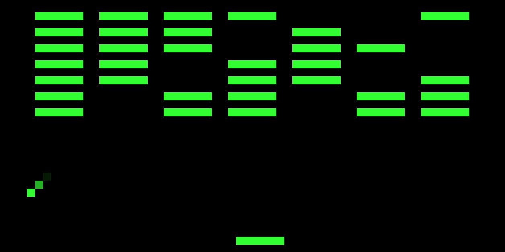

# C-Osmac: CHIP-8 Emulator

This is a CHIP-8 virtual machine and interpreter written in C. It emulates the fetch-decode-execute cycle of the original 1970s COSMAC VIP computer.




## Features

**Full Instruction Set:** Implementation of all 34 standard CHIP-8 opcodes.

**CRT Phosphor Decay:** Simulates 1970s monitor ghosting with Raylibs rendering loop.

**Configurable:** Support for both legacy COSMAC VIP and modern behaviors via toggles.

## Installation & Build

### Prerequisites
You need a C compiler (GCC preferred) and the [Raylib](https://www.raylib.com/) library installed on your system.
**Arch Linux:** `sudo pacman -S raylib`
**Debian/Ubuntu:** `sudo apt install libraylib-dev`

### Compiling
Clone the repository and compile using `gcc`:

```bash
git clone [https://github.com/ManiiChem/c-osmac.git](https://github.com/ManiiChem/c-osmac.git)
cd c-osmac
gcc main.c -o c-osmac -lraylib -O2
```

## Usage

1- Create a ROMs/ directory in the root folder.

2- Place your .ch8 game files inside the ROMs/ directory.

3- Edit the ROM_NAME configuration variable at the top of main.c to match your game.

4- Recompile and run:

```bash
./c-osmac
```

## Keypad

The original CHIP-8 hexadecimal keypad is mapped to the left cluster of a standard QWERTY keyboard:

| CHIP-8 Hex Keypad | Modern Keyboard (QWERTY) |
| :---: | :---: |
| <kbd>1</kbd> <kbd>2</kbd> <kbd>3</kbd> <kbd>C</kbd> | <kbd>1</kbd> <kbd>2</kbd> <kbd>3</kbd> <kbd>4</kbd> |
| <kbd>4</kbd> <kbd>5</kbd> <kbd>6</kbd> <kbd>D</kbd> | <kbd>Q</kbd> <kbd>W</kbd> <kbd>E</kbd> <kbd>R</kbd> |
| <kbd>7</kbd> <kbd>8</kbd> <kbd>9</kbd> <kbd>E</kbd> | <kbd>A</kbd> <kbd>S</kbd> <kbd>D</kbd> <kbd>F</kbd> |
| <kbd>A</kbd> <kbd>0</kbd> <kbd>B</kbd> <kbd>F</kbd> | <kbd>Z</kbd> <kbd>X</kbd> <kbd>C</kbd> <kbd>V</kbd> |

## Configuration

You can toggle historical hardware quirks by modifying the boolean variables at the top of main.c before compiling. By default, c-osmac is configured for maximum compatibility with modern ROMs.

```c
bool LEGACY_SHIFT = false;          // False for maximum compatibility
bool LEGACY_JUMP = false;           // False for maximum compatibility
bool AMIGA_INDEX_OVERFLOW = true;   // True for maximum compatibility
bool LEGACY_INDEX_SAVE = false;     // False for maximum compatibility
bool PHOSPHOR_DECAY_EFFECT = true;  // Toggle the CRT ghosting
```

## License

This project is open source and available under the [MIT License](LICENSE).